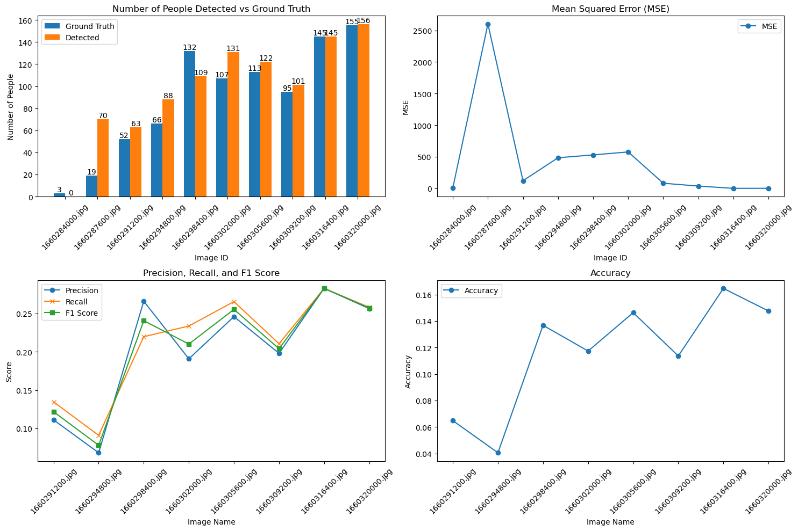
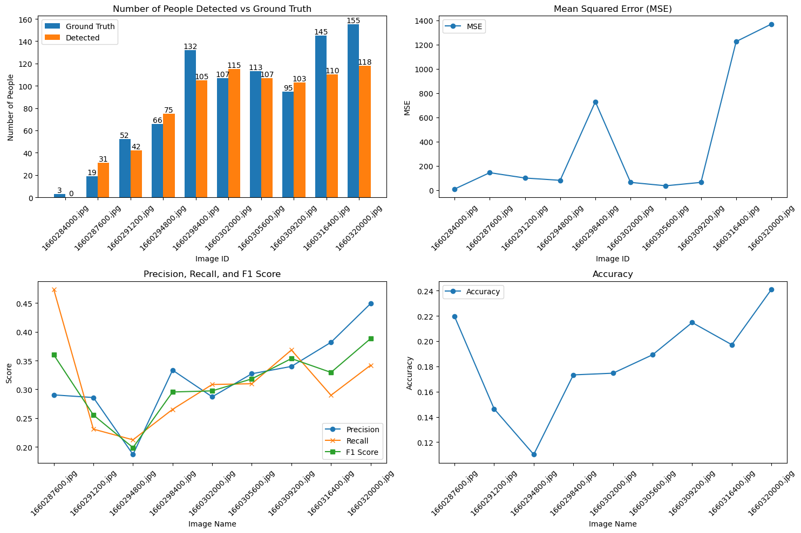
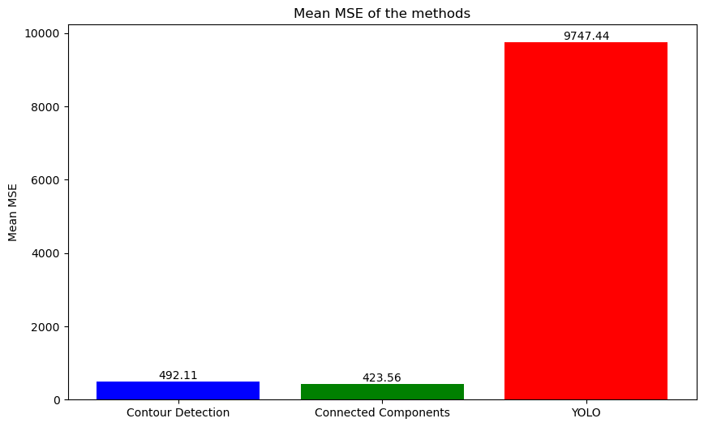

# Crowd Counting Project

## MUSI Image and Video Analysis

This repository contains the project files, code, and notebooks for the crowd counting project under the Image and Video Analysis course in the Masters of Intelligent Systems (MUSI) at the University of the Balearic Islands.

### Team

- Umar Faruk Abdullahi
- Raixa Aurora

## Project Overview

The goal of this project is to develop a system for detecting and counting people in images using image processing computer vision techniques. The project involves several key steps including image preprocessing, contour detection, and performance evaluation.

## Key Components

### 1. Image Preprocessing

- **CLAHE (Contrast Limited Adaptive Histogram Equalization)**: Enhances the contrast of images to improve the visibility of features.
- **LAB Color Space Conversion**: Converts images to LAB color space for better feature extraction.
- **RGB Distance Mask**: Computes the difference between the foreground and background images based on the RGB channels differences.

### 2. Techniques Used

- **Contour Detection**: Uses OpenCV to detect contours in preprocessed images.
- **Connected Components**: Uses OpenCV connected components to label region-like sections in the preprocessed images
- **Deep Learning with YOLO**: Finally, we run the YOLO model on the images to compare our approaches with advanced deep learning techniques.

### 3. Evaluation

- **Metrics Calculation**: Evaluates the performance of the detection system using metrics such as Mean Squared Error (MSE) true positives, false positives, and false negatives. We then compute the precision, recall, accuracy and F1 score for each image.

- **Performance Metrics**: Additionally, performance metrics such as the CPU utilization and memeory consumption are computed for every processed image.

## How to Use

Run the [Crowd Counting Notebook](./CrowdCountingProject.ipynb) in the root directory. It contains step by step instructions of how the project was implemented.


## Results

Among the three techniques mentioned above, the approach using connected components performed the best compared to the contour detection and deep learning approach. While deep learning solutions excel at diverse situations, this showcases their limitations in complex scenes where the features of the target object might not be clearly visible.


#### Contour Detection Results



#### Connected Components Results



### MSE Comparison




### File Structure

crowd_counting/ 
- data/ # Dataset files 
  - manual_alt.csv # Alternative annotations 
  - manual_annotations.csv # Ground truth annotations   
- imgs/ # Result visualizations 
  - contour_metrics.png 
  - connected_metrics.png 
  - final_mse_comparison.png 
- notebooks/ # Jupyter notebooks 
  - Crowd_Counting.ipynb 
  - protoproject.ipynb 
- src/ # Source code 
  - ConnectedComponents.py # Connected components detection 
  - ContourDetection.py # Contour detection implementation 
  - PerformanceMonitor.py # Performance tracking 
  - utils.py # Utility functions 
- CrowdCountingProject.ipynb # Main project notebook 
- README.md # Project documentation 
- requirements.txt # Python dependencies

### Prerequisites

- Python 3.x
- OpenCV
- NumPy
- Matplotlib
- Pandas

### Installation

1. Clone the repository:

```bash

git clone ufakz/crowd_counting
```

2.  Install the requirements

```bash

pip install -r requirements.txt
```

3. Run the Notebook - [Crowd Counting Project](./CrowdCountingProject.ipynb)